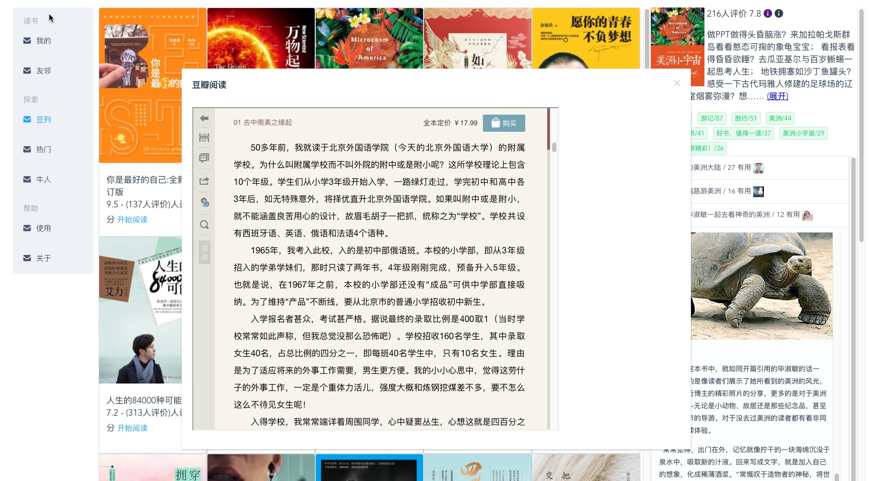

nvm use v7

[](https://circleci.com/gh/gaohailang/bookstore-web)

### 应用结构

命名相关：

book-digest

menu：
- actions[如导入，更新信息，豆瓣摘取等]
- 目录

worktable:

- basic-info
- outline-digest
- book-summary

table-side:
- amazon-preview, douban-preview, download-info
- douban-reviews, weixin-search


### 组件选择

- vuex - 状态管理
https://github.com/vuejs/vuex

- medium-editor
https://github.com/orthes/medium-editor-insert-plugin/wiki/v2.x-Using-with-webpack

- superagent, superagent-jsonp

- devtools
https://github.com/vuejs/vue-devtools

- transform-jsx
https://github.com/vuejs/babel-plugin-transform-vue-jsx

- affix
https://github.com/eddiemf/vue-affix

### 参考

note-taking app douban
https://github.com/NdYAG/ANNO

Chrome Package App
https://medium.com/@daix/migrate-from-chrome-packaged-app-to-electron-d101f95d880f


Douban API
https://github.com/cheeriojs/cheerio/issues/399

### Misc

豆瓣书评方案 爬虫
nodejs - scraperjs框架，scrapit 工具请求页面筛选内容等，node-osmosis 模拟交互ajax等
https://www.codementor.io/johnnyb/how-to-write-a-web-scraper-in-nodejs-du108266t

# bookstore

> book notes taking app




## Build Setup

``` bash
# install dependencies
npm install

# serve with hot reload at localhost:8080
npm run dev

# build for production with minification
npm run build

# build for production and view the bundle analyzer report
npm run build --report
```

For detailed explanation on how things work, checkout the [guide](http://vuejs-templates.github.io/webpack/) and [docs for vue-loader](http://vuejs.github.io/vue-loader).
